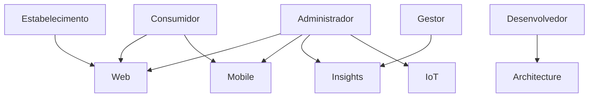

# Stakeholders

## Introdução

Os stakeholders representam todas as pessoas, organizações e sistemas que possuem interesse direto ou indireto no ecossistema CarneCerta.

Compreender seus objetivos, responsabilidades e necessidades é fundamental para orientar as decisões de negócio, arquitetura e desenvolvimento do projeto.

---

# Visão Geral

O ecossistema CarneCerta envolve diferentes perfis de stakeholders, cada um com interesses e expectativas específicas em relação à plataforma.

De forma geral, esses participantes podem atuar como usuários finais, responsáveis pela operação do sistema, tomadores de decisão ou consumidores das informações produzidas pela plataforma.

---

# Stakeholders do Ecossistema

| Stakeholder | Papel | Interesse |
|-------------|--------|-----------|
| Consumidor | Utiliza a plataforma para obter recomendações e informações sobre carnes. | Facilidade de uso, rapidez e informações confiáveis. |
| Estabelecimento Comercial | Disponibiliza produtos e utiliza informações da plataforma para apoiar suas operações. | Organização, visibilidade dos produtos e apoio à gestão. |
| Gestor | Utiliza indicadores e análises para apoiar a tomada de decisões. | Informações estratégicas e dashboards analíticos. |
| Desenvolvedor | Responsável pela implementação, manutenção e evolução do sistema. | Arquitetura organizada, documentação e boas práticas. |
| Administrador do Sistema | Gerencia configurações, usuários e funcionamento da plataforma. | Segurança, estabilidade e controle operacional. |

---

# Relação entre os Stakeholders

Cada stakeholder interage com um ou mais módulos do ecossistema CarneCerta.

---

# Necessidades dos Stakeholders

## Consumidor

- Encontrar facilmente o corte mais adequado;
- Obter informações claras e confiáveis;
- Navegar por uma interface simples e intuitiva.

---

## Estabelecimento Comercial

- Organizar informações sobre produtos;
- Melhorar a experiência dos clientes;
- Utilizar dados para apoiar decisões comerciais.

---

## Gestor

- Acompanhar indicadores de desempenho;
- Identificar tendências de vendas;
- Apoiar decisões estratégicas utilizando dados.

---

## Desenvolvedor

- Possuir documentação técnica organizada;
- Trabalhar com arquitetura padronizada;
- Facilitar manutenção e evolução do sistema.

---

## Administrador

- Garantir disponibilidade da plataforma;
- Gerenciar usuários e permissões;
- Manter segurança e estabilidade operacional.

---

# Responsabilidades

Cada stakeholder possui responsabilidades distintas dentro do ecossistema.

Enquanto consumidores e estabelecimentos utilizam os serviços disponibilizados pela plataforma, gestores utilizam as informações produzidas para apoiar decisões de negócio. Desenvolvedores e administradores atuam na evolução, manutenção e operação do sistema.

---

# Considerações

A identificação dos stakeholders contribui para que as decisões de arquitetura, desenvolvimento e evolução do CarneCerta permaneçam alinhadas às necessidades dos diferentes perfis de usuários envolvidos no ecossistema.