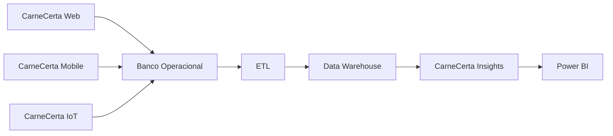

# ADR-002 — Adoção da Arquitetura de Dados (OLTP + Data Warehouse)

## Status

Accepted

---

# Contexto

O ecossistema CarneCerta possui módulos responsáveis pelas operações do sistema, como cadastro de produtos, clientes e vendas, e um módulo analítico (**CarneCerta Insights**) voltado para Business Intelligence.

Era necessário definir uma arquitetura de dados que suportasse tanto as operações do sistema quanto a geração de indicadores estratégicos, sem comprometer o desempenho das aplicações.

---

# Problema

Executar consultas analíticas diretamente sobre o banco de dados operacional pode causar:

- redução de desempenho das operações;
- aumento da complexidade das consultas;
- maior acoplamento entre funcionalidades operacionais e analíticas;
- dificuldade de evolução do ambiente de Business Intelligence.

---

# Decisão

Foi adotada uma arquitetura composta por duas camadas distintas:

- Banco de Dados Operacional (OLTP);
- Data Warehouse (OLAP).

Os dados são extraídos do ambiente operacional por meio de um processo ETL e carregados no Data Warehouse, que é utilizado exclusivamente para análises e geração de indicadores.

---

# Arquitetura Adotada

---

# Responsabilidades

## Banco Operacional (OLTP)

Responsável pelas operações do sistema.

Exemplos:

- cadastro de clientes;
- cadastro de produtos;
- registro de vendas;
- movimentações operacionais.

---

## Processo ETL

Responsável por:

- extrair os dados do ambiente operacional;
- transformar e padronizar as informações;
- carregar os dados no Data Warehouse.

---

## Data Warehouse

Responsável pelo armazenamento analítico.

Contém os dados preparados para:

- consultas analíticas;
- dashboards;
- indicadores de desempenho;
- apoio à tomada de decisão.

---

# Benefícios

A arquitetura adotada proporciona:

- separação entre operação e análise;
- melhor desempenho das consultas analíticas;
- menor impacto sobre o ambiente operacional;
- maior escalabilidade;
- facilidade para evolução do ambiente de Business Intelligence.

---

# Consequências

## Positivas

- Ambiente analítico independente;
- Melhor organização dos dados;
- Facilidade para criação de dashboards;
- Melhor desempenho das análises.

## Negativas

- Necessidade de manter o processo ETL;
- Duplicação controlada dos dados entre os ambientes;
- Maior complexidade na infraestrutura de dados.

---

# Decisões Relacionadas

- ADR-001 — Adoção de Arquitetura Modular
- ADR-003 — Adoção do Star Schema
- ADR-004 — Arquitetura do CarneCerta Insights