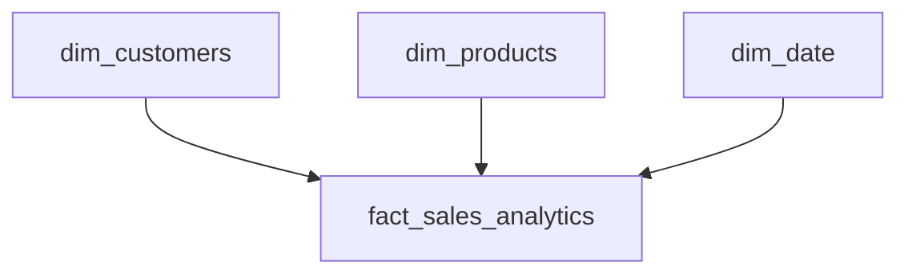

# ADR-003 — Adoção do Star Schema

## Status

Accepted

---

# Contexto

O módulo **CarneCerta Insights** foi desenvolvido para transformar dados operacionais em informações estratégicas, permitindo a criação de dashboards, indicadores de desempenho e análises de negócio.

Para atender a esse objetivo, era necessário definir um modelo de dados analítico otimizado para consultas e ferramentas de Business Intelligence.

---

# Problema

O modelo relacional utilizado no banco operacional foi projetado para registrar transações e garantir integridade dos dados.

Embora adequado para operações do sistema, esse modelo apresenta limitações para análises analíticas devido à necessidade de múltiplos relacionamentos entre tabelas, tornando as consultas mais complexas e menos eficientes.

---

# Decisão

Foi adotado o modelo dimensional **Star Schema** para estruturar o Data Warehouse do módulo CarneCerta Insights.

Nesse modelo, uma tabela fato concentra as métricas do negócio, enquanto tabelas dimensão armazenam informações descritivas utilizadas nas análises.

---

# Modelo Adotado

---

# Estrutura

## Tabela Fato

A tabela **fact_sales_analytics** armazena os indicadores utilizados nas análises.

Exemplos:

- quantidade vendida;
- receita;
- custo;
- lucro.

---

## Tabelas Dimensão

As dimensões armazenam informações descritivas utilizadas para segmentação e análise dos dados.

Dimensões atuais:

- dim_customers;
- dim_products;
- dim_date.

Novas dimensões poderão ser adicionadas conforme a evolução do projeto.

---

# Motivos da Escolha

O Star Schema foi adotado pelos seguintes motivos:

- simplicidade da modelagem;
- consultas analíticas mais eficientes;
- facilidade de integração com o Power BI;
- facilidade de manutenção;
- escalabilidade para futuras expansões do Data Warehouse.

---

# Benefícios

A utilização do Star Schema proporciona:

- melhor desempenho em consultas analíticas;
- simplificação dos relacionamentos entre tabelas;
- organização dos dados para Business Intelligence;
- maior facilidade na criação de dashboards;
- suporte ao crescimento do ambiente analítico.

---

# Consequências

## Positivas

- Modelo de dados simples e organizado;
- Melhor desempenho para consultas e dashboards;
- Facilidade para criação de novas dimensões;
- Maior compatibilidade com ferramentas de BI.

## Negativas

- Duplicação controlada de informações dimensionais;
- Necessidade de manutenção do processo ETL para atualização das dimensões e da tabela fato.

---

# Decisões Relacionadas

- ADR-001 — Adoção de Arquitetura Modular
- ADR-002 — Adoção da Arquitetura de Dados (OLTP + Data Warehouse)
- ADR-004 — Arquitetura do CarneCerta Insights