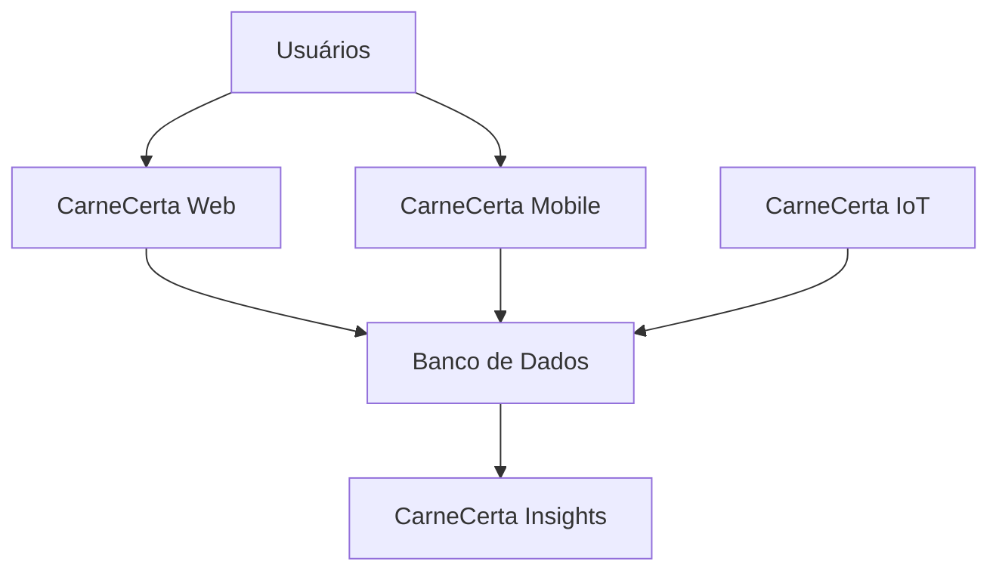
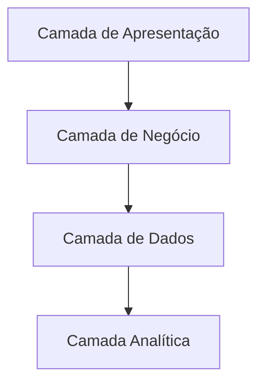

# Architecture Overview

## Visão Geral

O **CarneCerta** é um ecossistema de soluções digitais desenvolvido para integrar diferentes módulos especializados em uma única plataforma.

Sua arquitetura foi projetada com foco em modularidade, escalabilidade, manutenibilidade e acessibilidade, permitindo que cada componente evolua de forma independente sem comprometer o funcionamento do ecossistema.

Os módulos compartilham informações por meio de integrações definidas e responsabilidades bem estabelecidas.

---

# Visão do Ecossistema

---

# Módulos do Ecossistema

## CarneCerta Web

Responsável pela experiência principal do usuário.

Principais responsabilidades:

- catálogo de produtos;
- recomendações de cortes;
- mapa do boi;
- informações sobre carnes;
- recursos de acessibilidade;
- integração com os demais módulos.

---

## CarneCerta Mobile

Responsável por disponibilizar funcionalidades da plataforma em dispositivos móveis.

Principais responsabilidades:

- acesso móvel;
- consulta de informações;
- sincronização com o ecossistema.

---

## CarneCerta Insights

Responsável pela camada analítica do projeto.

Principais responsabilidades:

- processamento analítico;
- indicadores de desempenho;
- dashboards;
- apoio à tomada de decisão.

---

## CarneCerta IoT

Responsável pela integração com dispositivos inteligentes.

Principais responsabilidades:

- coleta de dados;
- monitoramento;
- integração com sensores;
- envio de informações ao ecossistema.

---

# Princípios Arquiteturais

A arquitetura do CarneCerta é baseada nos seguintes princípios:

- Arquitetura modular;
- Baixo acoplamento;
- Alta coesão;
- Escalabilidade;
- Documentação contínua;
- Segurança;
- Acessibilidade desde a concepção (*Accessibility by Design*);
- Evolução incremental.

---

# Acessibilidade

A acessibilidade é um princípio arquitetural do CarneCerta.

O ecossistema é projetado para oferecer uma experiência digital inclusiva, permitindo que pessoas com diferentes necessidades utilizem a plataforma de forma autônoma.

No módulo Web, estão previstos recursos específicos para ampliar a acessibilidade, incluindo suporte à tradução da interface para Libras e outras tecnologias assistivas que poderão ser incorporadas conforme a evolução do projeto.

---

# Organização da Arquitetura

A arquitetura do CarneCerta está organizada em camadas de responsabilidade.

---

# Benefícios da Arquitetura

A arquitetura adotada proporciona:

- facilidade de manutenção;
- evolução independente dos módulos;
- integração entre soluções;
- suporte à escalabilidade;
- organização da documentação;
- facilidade para incorporação de novas funcionalidades;
- preparação para futuras integrações.

---

# Referências

Os detalhes de cada componente arquitetural são apresentados nos documentos desta seção:

- `system-context.md`
- `data-model.md`
- `integrations.md`
- `decisions/`