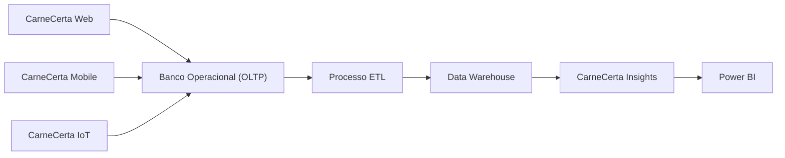
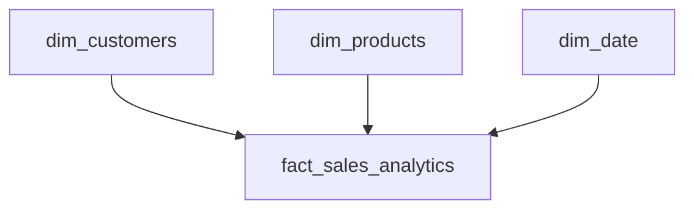

# Data Model

## Visão Geral

O ecossistema CarneCerta utiliza uma arquitetura de dados composta por duas camadas principais:

- Banco de Dados Operacional (OLTP);
- Data Warehouse (OLAP).

Essa separação permite que as operações do sistema permaneçam independentes das análises de negócio realizadas pelo módulo **CarneCerta Insights**.

---

# Arquitetura de Dados

---

# Banco de Dados Operacional (OLTP)

O banco operacional é responsável pelo armazenamento das informações utilizadas diariamente pelos módulos do ecossistema.

Entre seus principais dados estão:

- clientes;
- produtos;
- vendas;
- itens de venda;
- categorias;
- usuários.

Essa camada prioriza consistência, integridade e desempenho das operações transacionais.

---

# Processo ETL

O processo de ETL (Extract, Transform and Load) é responsável por preparar os dados para análise.

Suas responsabilidades incluem:

- extração dos dados operacionais;
- transformação e padronização das informações;
- carregamento no Data Warehouse.

Essa separação reduz o acoplamento entre o ambiente transacional e o ambiente analítico.

---

# Data Warehouse

O Data Warehouse é responsável pelo armazenamento dos dados analíticos utilizados pelo módulo CarneCerta Insights.

Foi adotada uma modelagem dimensional baseada em **Star Schema**, priorizando simplicidade, desempenho e facilidade de manutenção.

---

# Modelo Dimensional

O modelo analítico é composto por uma tabela fato e tabelas dimensão.

---

# Tabelas Dimensão

As dimensões armazenam informações descritivas utilizadas nas análises.

Principais dimensões:

- dim_customers;
- dim_products;
- dim_date.

Cada dimensão possui uma chave substituta (*Surrogate Key*) para facilitar a evolução do modelo analítico.

---

# Tabela Fato

A tabela **fact_sales_analytics** concentra os indicadores utilizados nas análises.

Exemplos de informações armazenadas:

- quantidade vendida;
- receita;
- custo;
- lucro;
- data da venda;
- cliente;
- produto.

---

# CarneCerta Insights

O módulo CarneCerta Insights consome os dados do Data Warehouse para gerar indicadores estratégicos.

Entre suas responsabilidades estão:

- consultas analíticas;
- indicadores de desempenho;
- dashboards;
- apoio à tomada de decisão.

---

# Princípios Adotados

A arquitetura de dados segue os seguintes princípios:

- separação entre ambiente operacional e analítico;
- utilização de Star Schema;
- baixa complexidade das consultas analíticas;
- facilidade de expansão do modelo;
- integração com ferramentas de Business Intelligence.

---

# Evolução

A arquitetura foi planejada para suportar futuras melhorias, incluindo:

- novas tabelas dimensão;
- novas tabelas fato;
- carga incremental;
- automação do ETL;
- otimização de consultas;
- expansão dos indicadores analíticos.