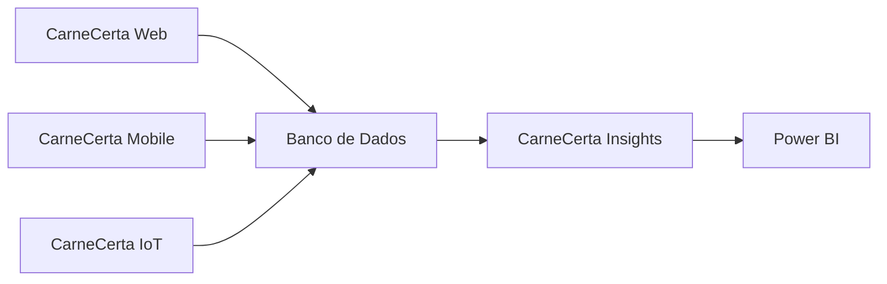
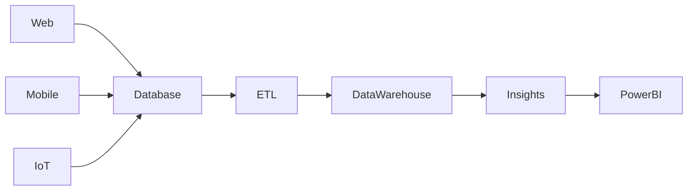

# Integrations

## Visão Geral

O ecossistema CarneCerta é composto por módulos independentes que se comunicam por meio de integrações definidas pela arquitetura da solução.

Essa abordagem promove baixo acoplamento, facilita a manutenção e permite a evolução independente de cada módulo.

---

# Visão das Integrações

---

# Integrações Internas

## CarneCerta Web

Responsável pela interação principal com os usuários.

Integra-se com:

- Banco de Dados;
- CarneCerta Mobile (compartilhamento de informações);
- CarneCerta Insights (consumo indireto de indicadores);
- Recursos de acessibilidade.

---

## CarneCerta Mobile

Responsável por disponibilizar funcionalidades da plataforma em dispositivos móveis.

Integra-se com:

- Banco de Dados;
- CarneCerta Web;
- Serviços de autenticação.

---

## CarneCerta IoT

Responsável pela coleta e envio de informações provenientes de dispositivos inteligentes.

Integra-se com:

- Banco de Dados;
- CarneCerta Insights.

---

## CarneCerta Insights

Responsável pelo processamento analítico.

Consome dados provenientes de:

- Banco Operacional;
- Processo ETL;
- Data Warehouse.

Disponibiliza informações para:

- Dashboards;
- Indicadores estratégicos;
- Relatórios.

---

# Integrações Externas

O ecossistema poderá integrar-se com serviços externos conforme sua evolução.

Exemplos:

- Firebase;
- Power BI;
- APIs de terceiros;
- Serviços de autenticação;
- Serviços de monitoramento.

---

# Fluxo de Dados

---

# Princípios de Integração

As integrações do CarneCerta seguem os seguintes princípios:

- baixo acoplamento;
- alta coesão;
- comunicação entre módulos por responsabilidades bem definidas;
- escalabilidade;
- facilidade de manutenção;
- evolução independente dos componentes.

---

# Evolução

Novas integrações poderão ser adicionadas conforme o crescimento do ecossistema, mantendo compatibilidade com os princípios arquiteturais definidos para o projeto.