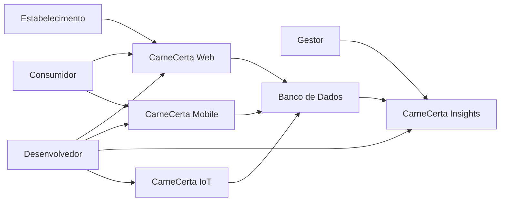
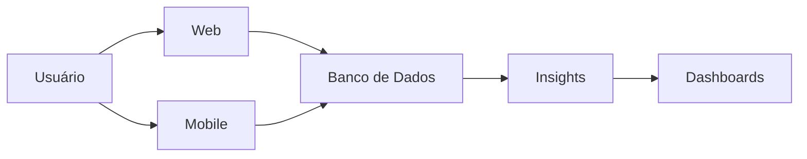

# System Context

## Visão Geral

O CarneCerta é um ecossistema composto por diferentes módulos que atendem consumidores, estabelecimentos comerciais e gestores, integrando funcionalidades operacionais, analíticas e de monitoramento em uma única plataforma.

Cada módulo possui responsabilidades específicas e comunica-se com os demais por meio de integrações definidas pela arquitetura.

---

# Diagrama de Contexto

---

# Principais Usuários

| Usuário | Objetivo |
|----------|----------|
| Consumidor | Consultar produtos, recomendações e informações sobre carnes. |
| Estabelecimento Comercial | Disponibilizar produtos e utilizar os recursos da plataforma. |
| Gestor | Acompanhar indicadores e apoiar decisões utilizando dados. |
| Desenvolvedor | Evoluir e manter o ecossistema CarneCerta. |

---

# Módulos

## CarneCerta Web

Interface principal da plataforma para consumidores e estabelecimentos.

---

## CarneCerta Mobile

Aplicação móvel para acesso às funcionalidades do ecossistema.

---

## CarneCerta Insights

Plataforma de Business Intelligence responsável pela análise dos dados.

---

## CarneCerta IoT

Módulo responsável pela integração com dispositivos inteligentes.

---

# Sistemas Externos

O ecossistema poderá integrar-se com serviços externos, conforme sua evolução.

Exemplos:

- Firebase;
- Power BI;
- APIs externas;
- Serviços de autenticação;
- Plataformas de monitoramento.

---

# Fluxo Geral

---

# Acessibilidade

A acessibilidade faz parte do contexto do sistema desde sua concepção.

O módulo Web foi projetado para incorporar recursos que promovam inclusão digital, permitindo que pessoas com deficiência auditiva possam navegar e realizar compras com maior autonomia por meio do suporte à tradução para Libras.

Novos recursos de acessibilidade poderão ser incorporados conforme a evolução do ecossistema.

---

# Considerações

Este documento apresenta a visão de contexto do ecossistema CarneCerta.

Os detalhes da arquitetura interna, das integrações e do modelo de dados são documentados nos demais arquivos da seção **Architecture**.